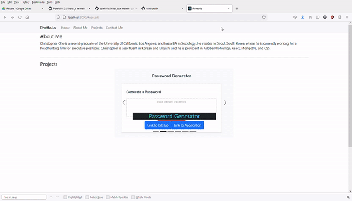

# React Profile 

  ## Description 
  React Profile

  ## Table of Contents
  * [Installation](#installation)
  * [Usage](#usage)
  * [License](#license)
  * 
  ## Installation
  run npm i in terminal. Then run npm run start.

  ## Usage 
  View my profile

  ## License
  This product uses a MIT license

  ## Demo
  

  ## Questions
  For additional questions feel free to contact: chrischo2012@gmail.com
  GitHub: https://github.com/chrischo94
  